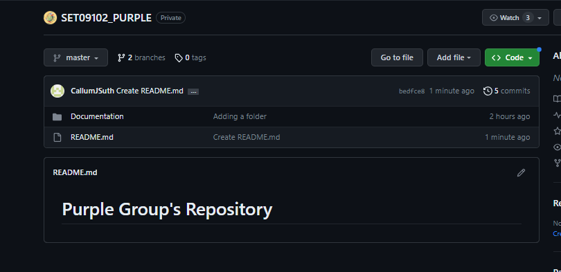

# Description of Task 

For this week we were tasked with setting up the basic structure and resources we would use throughout the year and any further projects. 

Individually, we were also tasked with setting up Visual Studio to a set of specifications and setting up a portfolio (The one you are on now!) for displaying future  work. 

# Evidence of Work 

## Group Git Repository 

Our group (Purple) set up a group Github Repository as seen in screenshot (One) and (Two). This will be very useful as a hub for all of our work and also allows us to work on projects in tandem with each other and offer changes and optimizations to code. Although basic at this stage, this will go on to become very developed as the course progresses. 

Setting up a project in this repository was also a required part of this task, ensuring it had an integrated task board which helps with keeping group work organised and up to date. This can be seen in screenshot (Three). 

## Personal Tasks 

I was required to set up Visual Studio from scratch as I had never worked with it before. This entailed going through this installation process as well as customising it based on specifications given to us. This allows us to use it to work on future tasks using VS. I have just shown this in a general screenshot of VS as well as one of the downloaded extensions page. (Four & Five)

Furthermore, creating a portfolio on Github for posting my work was required. This is shown in screenshot (Six) or just by going to the main page of this repository. 

Finally, I was tasked with cloning our group repository and linking my Github account to VS. For the first task, it was a simple process of just taking the HTML link and giving it to VS code (Show in screenshot (Seven) ) . And for the second, all that needed done was changing my account information to match the email and password of my Github account, which is shown in screenshot (Eight).   

# Screenshots 

1.

2.

3.

4.

5.

6.

7.

8.

